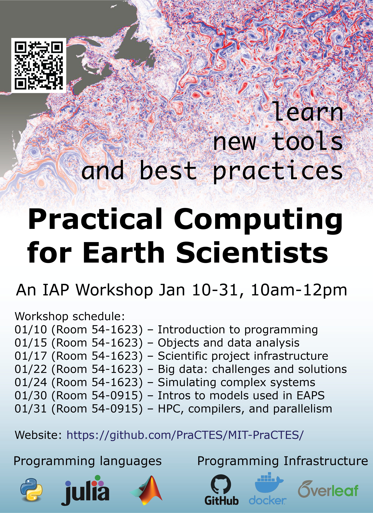

## MIT Practial Computing Tutorials for Earth Scientists (PraCTES)

This github site is the home page for the PraCTES workshop organized at MIT proper, the inaugural member of the broader [PraCTES organization](github.com/PraCTES) which we hope will eventually expand to other groups, department, or institutions.

#### About MIT PraCTES
The PraCTES workshop is a series of demos and hands-on tutorials for practical computing *by earth scientists* and *for earth scientists*. The goal of the workshop is to introduce practical computational tools and concepts so that earth scientists can spend more doing science and less time debugging data analysis code, processing large data sets, deciphering model source code, and other frustrating and time-consuming tasks of modern earth science research. We aim to make the workshop accessible and useful to scientists with all levels of programming proficiency and will cover topics ranging from introductory concepts in programming to state-of-the-art software tools for wrangling big data on the Cloud.

Each two-hour session will be highly interactive: instructors will swap between presenting background information on topics (e.g. What is an Earth System Model? How does github work behind the scenes?), demonstrating computing concepts with live demos and leading hands-on code tutorials and exercises, which attendees can follow along with in real-time on their personal laptops. Attendees should feel free to opt-in and opt-out at whichever point in the curriculum they feel is appropriate. Whenever possible, our demos and hands-on tutorials will be agnostic of programming language and earth science subfield, recognizing the many ways in which people engage with computation in earth science. To get the most out of the workshop, **bring a laptop** and follow along!

#### How to access the code tutorials
Click  to launch the default code tutorial environment in your browser (no downloads required) for both the Python and Julia programming languages, as well as various terminal-based tutorials and exercises! Some of the session demos reference external repositories or Google Cloud instances; see their respective README files for more information.

To run the Matlab scripts, you will need to install Matlab (version > 2019b).

Information on how to run the Python and Julia notebooks on your personal machine (and how to set up your own Python / Julia environments for a scientific project) can be found in the [Lecture01 README](https://github.com/PraCTES/MIT-PraCTES/blob/master/demos/Lecture01_Intro_Programming/README.md).

### January 2020 MIT PraCTES Flyer

